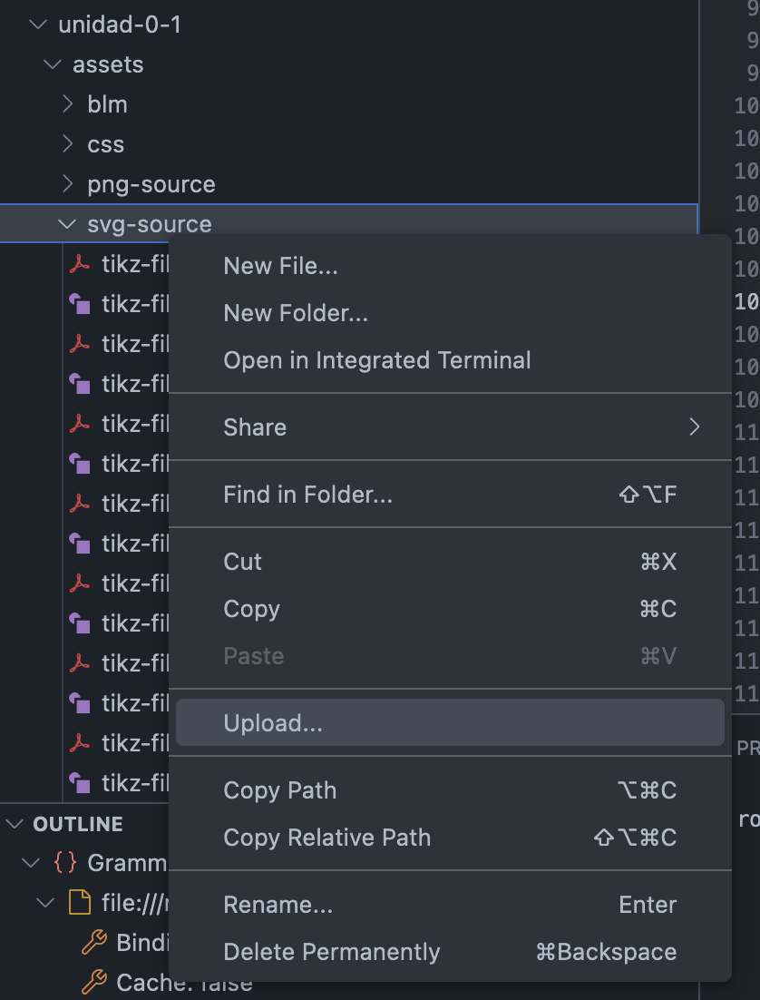

## Para insertar una imagen

1. Guardar una copia de la imagen que se quiere agregar en el computador propio. Por ejemplo, hacer clic derecho en la imagen y `save image as`.
    
    


2. Subir (agregar) la imagen al repositorio (en un vscode codespace) para poder incluirla:
   *   la carpeta en la que se pone la imagen depende del formato: 

       | Formato imagen | se sube a la carpeta  |
       | ------------- | ------------- |
       | .svg  | source/assets/svg-source  |
       | .png  | source/assets/png-source  |
       | .jpg  | source/assets/jpg-source  |

   *  si está usando VSCode en su computador (no está en el navegador web):
       - para subir (agregar) la imagen al repositorio, debe arrastrar (drag-and-drop) el archivo a la carpeta correspondiente  
         
         

        

   *  si está usando el codespace en el navegador web:
      -  para subir (agregar) la imagen al repositorio, debe hacer click derecho en la carpeta correspondiente y seleccionar `upload`. Después seleccionar el archivo que quiere agregrar. Asegúsere de que el nombre del archivo no esté siendo usado ya.

        


3. Para incluir la imagen en el código fuente `.ptx`, se usa un código como este:
    ```xml
    <image source="path (no extension)" width="% of text width">
        <shortdescription>(alt-text for accessibility)</shortdescription>
    </image>
    ```
   
   **ejemplo 1:** para la imagen `.svg` con nombre `tikz-file-147472.svg`, el código es:
    ```xml
    <image source="svg-source/tikz-file-147472">
       <shortdescription>30 objetos en grupos de 5</shortdescription>
    </image>
    ```
    (si es una imagen `.svg` de `svg_source`, no se incluye el width ni la extensión `.svg`)

   **ejemplo 2:** para la imagen `.png` con nombre `CS 3.4 Lesson 18 Activity 1.png`, el código es:
    ```xml
    <image source="png-source/CS 3.4 Lesson 18 Activity 1.png" width="100%">
       <shortdescription>Un acuario</shortdescription>
    </image>
    ```
    
    **Note que:** no se incluye la extensión (`.svg`) en el `source="...`. Esto es MUY importante para que PreTexT agregue la extensión apropiada de acuerdo al formato (es distinto si es una página web, o un pdf con LaTeX)

4. Si las imágenes son de `png-source` o `jpg-source`, hay que agregar el `width="_____%"` y hay que ajustar el porcentaje deseado revisando la página web generada (build).